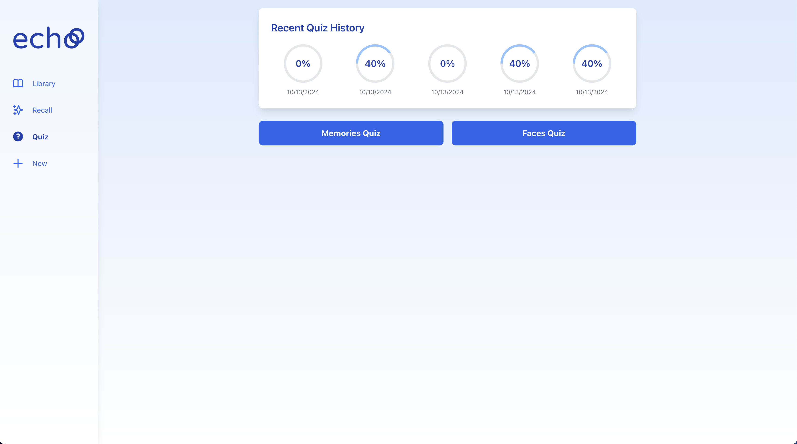
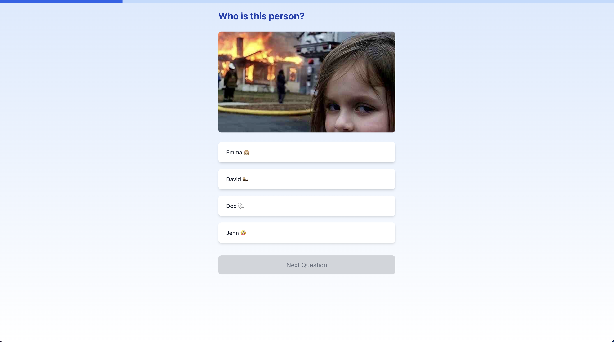

# Echo: A Shared Memory Platform for Alzheimer's Support

## Inspiration

Most of our team members have known or had family members affected by Alzheimer's, which deeply inspired us to develop this project. Our goal was to create something that could offer real, tangible support to families in a similar situation. From a product standpoint, we drew inspiration from platforms like Netflix and Instagram, aiming to create a smooth, intuitive user interface with simple, seamless navigation to encourage frequent use. We also looked to apps like Woocalp for their structured quiz formats, integrating them to help Alzheimer's patients with memory recall.

## What it does

Echo is a shared platform for families to support loved ones with Alzheimer's by creating a collective memory album. Each family member can post souvenirs, pictures, and comments in a shared space. Echo features an AI-powered chatbot using Retrieval-Augmented Generation (RAG) to help users and doctors retrieve important information from past posts. Additionally, Echo includes two types of personalized memory quizzes: one for recognizing family members using face recognition, and another to help recall specific moments based on souvenirs. These quizzes are powered by smart question generation using Thompson sampling, which balances exploration (generating new questions from souvenirs) and exploitation (reusing previously encountered questions). When a user struggles with a question, its likelihood to reappear increases, ensuring a personalized and adaptive quiz experience.

## How we built it

Our front end was built using React, while the backend was developed with FastAPI. We structured the application into three main interfaces: the primary broker "app" that handles data, the RAG interface for chatbot interactions, and the quiz interface for generating quizzes using Thompson sampling. For question generation, we alternate between exploration and exploitation—exploration involves generating new questions based on souvenirs, while exploitation uses existing questions that the user has already encountered. If a user fails a question, its parameter is adjusted to increase the likelihood of it reappearing in future quizzes. This dynamic helps to balance learning and memory retention over time.

## Challenges we ran into

We encountered the classic challenges of building a social media-like application, particularly in ensuring that the user interface is smooth and intuitive. Making sure all the components—posts, comments, quizzes, and the chatbot—worked seamlessly together was a constant challenge. Ensuring the quiz system balanced difficulty and engagement, especially in using Thompson sampling for dynamic question generation, also required careful tweaking.

## Accomplishments that we're proud of

We’re proud to have built a project that has the potential to truly improve people’s lives, particularly those affected by Alzheimer’s and their families. Another accomplishment we take pride in is successfully delivering a fully functional demo with a robust set of features. Despite the complexity of the project, we were able to implement the core components—such as the RAG-powered chatbot, smart quizzes, and family-sharing functionality—into a cohesive, working product.

## What we learned

Throughout the development of Echo, we learned a great deal about balancing technology and user experience, especially when designing for individuals with cognitive impairments. The project also taught us the importance of empathy in product design—understanding the unique needs of users and creating a product that meets those needs effectively. We gained valuable experience working with machine learning models like RAG, as well as building robust, secure systems that handle sensitive data.

## What's next for Echo

There is a lot of room for improvement in Echo, and we have many ideas for expanding its features. One of our next goals is to implement weekly reports summarizing the patient's treatment progress. We also conducted a survey with people who have family members affected by Alzheimer's, which gave us plenty of feature requests, including task tracking, medication and meeting reminders (agenda), music memory recalls, a communication system, and the ability to store and use family members' voices within the platform.
